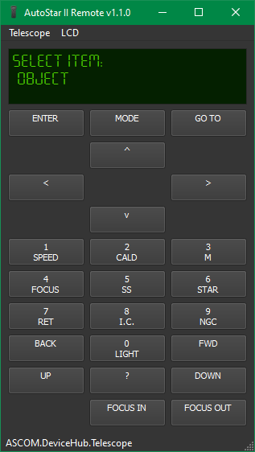

# AutoStar II Remote

This is a fork of original repository:
https://github.com/scriptorron/AutoSTAR_remote/blob/main/src/AutoSTAR_remote.py

This is a GUI to remote control (using ASCOM or serial interface) the Meade AutoStar II handheld.

Press [SHIFT] when clicking on "ENTER", "MODE" or "GO TO" to generate a long key press.

You can change the serial port parameters when connecting with UART. Default parameters for the MEADE AutoStar II:
- Speed: 9600 baud
- 8 data bits
- 1 stop bit
- no parity
- no flow control

When connecting with the serial port you have the option to set the time and date of the AutoStar to the computer clock. This feature is not fully tested. Especially the daylight saving may be wrong. Please check the AutoStar settings if you see strange errors when doing GOTO to an object.

ASCOM driver https://bitbucket.org/cjdskunkworks/meadeautostar497 must be installed.

For running the Python source code you need the following packages:
- PyQt5
- pyserial
- win32com when using ASCOM on Windows

The Python source code runs also on Raspberry Pi (Astroberry). 
